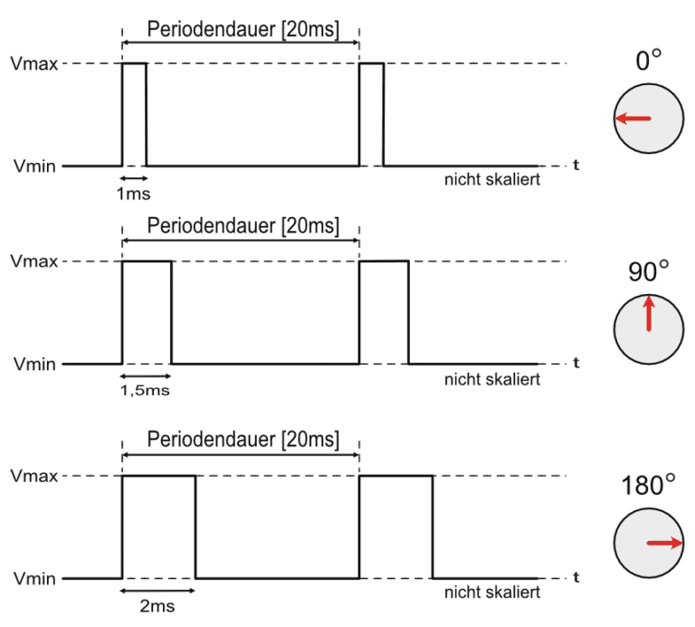

# DC Servo Steering System

## Overview
This project involves designing and implementing a **closed-loop control system** for the steering fins of a boat. The system utilizes a **PID controller** and an **IIR filter** to control the position of the steering fins, ensuring precise and stable operation.

---

## Features
- **Input Control**: Accepts a typical RC servo 50Hz PWM signal (1000–2000µs pulse width) for steering commands.
- **Feedback Mechanism**: Uses a 10k potentiometer connected to the motor's shaft to measure the current position.
- **Closed-loop Control**: Adjusts motor position using a PID controller based on the difference between desired and actual positions.
- **Scalability**: Supports multiple motors while sharing a single input signal.

---

## How It Works
1. **Input Signal**:
   - The system reads a 50Hz PWM signal as input.
   - The pulse width (1000–2000µs) determines the desired position of the steering fins.
   - Other input options (e.g., digital numbers via CANBUS) can replace the PWM signal in future implementations.
     

2. **Feedback Loop**:
   - The potentiometer value is read via ADC (10-, 12-, or 14-bit resolution) and mapped to the same range (1000–2000µs) as the input.
   - The error is calculated as the difference between the input signal (desired position) and the feedback (actual position).

3. **PID Controller**:
   - The error is processed through a PID controller to compute the correction needed for the motor.
   - The PID output determines the motor's new position.

4. **Motor Control**:
   - The motor is driven by a PWM signal, with direction control managed by a dedicated pin.
   - The IIR filter smooths out ADC noise for stable operation.

5. **Pulse Measurement**:
   - A separate module, `PulseMeasurement`, is responsible for measuring the input 50Hz PWM signal. 
   - Only **one instance** of this object is needed, regardless of the number of motors in the system. - Each motor object (e.g., `motor1`, `motor2`, ..., `motorN`) receives a pointer to the `PulseMeasurement` instance. This ensures that all motor instances are synchronized and triggered by the same input signal.
   -  The `PulseMeasurement` module is configurable, allowing you to adjust the frequency and pulse width limits depending on the application. This makes it versatile for different RC servo signal setups.
    - This design enables seamless scalability when adding more motors, as the common input signal is consistently managed by the shared `PulseMeasurement` object.

---

## Project Structure
- **`main.ino`**: Entry point of the program, initializes components and handles the main control loop.
- **`init.h`**: This file stores all global variables and constants used across the project.
- **`motor.h` / `motor.cpp`**: Defines the `Motor` class, responsible for controlling individual motors and managing PID logic.
- **`pidcontrol.h` / `pidcontrol.cpp`**: Implements the PID controller, which calculates corrections based on input, setpoint, and feedback.
- **`pulsemeasurement.h` / `pulsemeasurement.cpp`**: Manages the measurement of the 50Hz input PWM signal.

---

## Components
- **Microcontroller - Arduino R4**: Reads input signals, processes feedback, and generates PWM outputs.
- **DC Driver - MDDS10**: Drives the motor based on the PWM and direction signals from the microcontroller.
- **Encoder - 10k Potentiometer**: Provides position feedback from the motor shaft.
- **Input signal**: Commands the desired position.

---

## Usage

### Hardware Connections
1. Connect the PWM input pin to the RC servo signal source.
2. Attach the potentiometer to the motor shaft for position feedback.
3. Connect the motor to the DC driver and the driver to the microcontroller.
4. Ensure all components share a common ground.

### Code Setup
1. Clone the repository and upload the code to your microcontroller using the Arduino IDE.
2. Adjust the i nputparameters in the `Motor` initialization to suit your application.

### Example Initialization
```cpp
PulseMeasurement pulseMeasure(PWM_INPUT_PIN);

Motor motor_left(ADC_LEFT, MOTOR_LEFT_PWM, MOTOR_LEFT_DIR, POT_MIN_LEFT, POT_MAX_LEFT, 5.0, 2.49, 0.15, &pulseMeasure);
Motor motor_right(ADC_RIGHT, MOTOR_RIGHT_PWM, MOTOR_RIGHT_DIR, POT_MIN_RIGHT, POT_MAX_RIGHT, 5.0, 2.49, 0.15, &pulseMeasure);

void setup() {
    pulseMeasure.init();
    motor_left.init();
    motor_right.init();
    attachInterrupt(digitalPinToInterrupt(PWM_INPUT_PIN), []() { pulseMeasure.measure(); }, CHANGE);
}

void loop() {
    motor_left.update();
    motor_right.update();
    delay(100);
}
```
 - **`int adcPin`**: Pin for the feedback potentiometer ADC value. 
 - **`int pwmPin`**: Pin for the output PWM signal to control motor speed. 
 -  **`int dirPin`**: Pin to set the motor's direction of rotation.
 - **`int pot_min, int pot_max`**: Extreme ADC values for the potentiometer that define the allowed range of movement. These act as soft limits to avoid mechanical stress, similar to end switches.
  - **`double Kp, Ki, Kd`**: Parameters used in the PID calculations for proportional, integral, and derivative control. 
  - **`PulseMeasurement* pulse`**: Pointer to an instance of the `PulseMeasurement` object. This is used for synchronizing the motor with the shared 50Hz input PWM signal.
