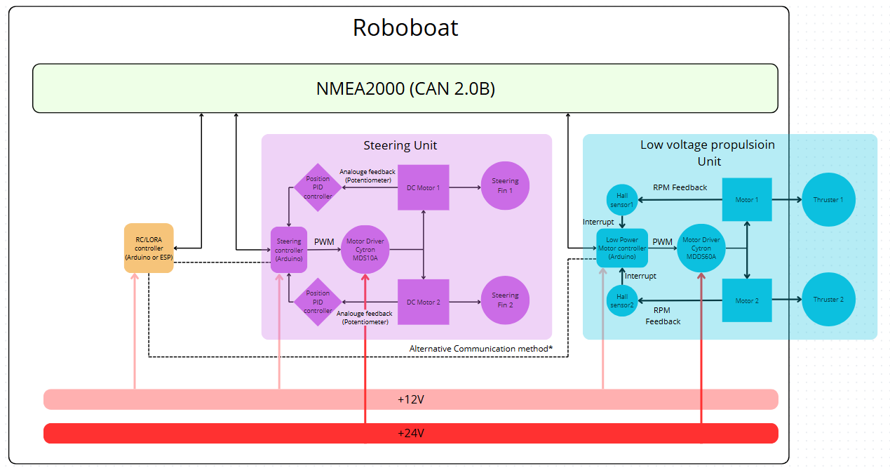
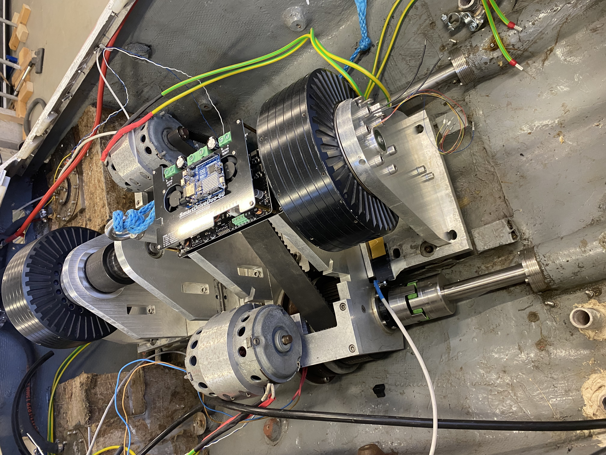
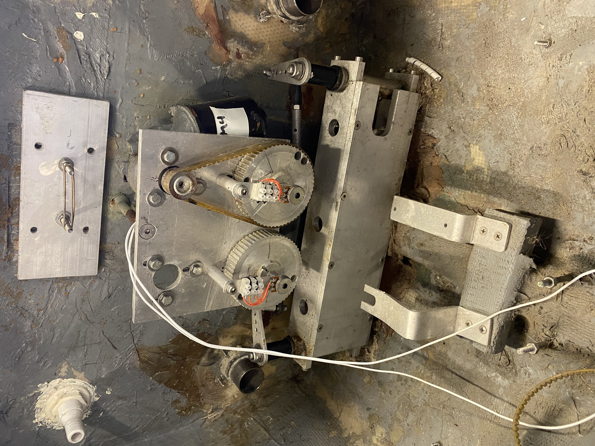
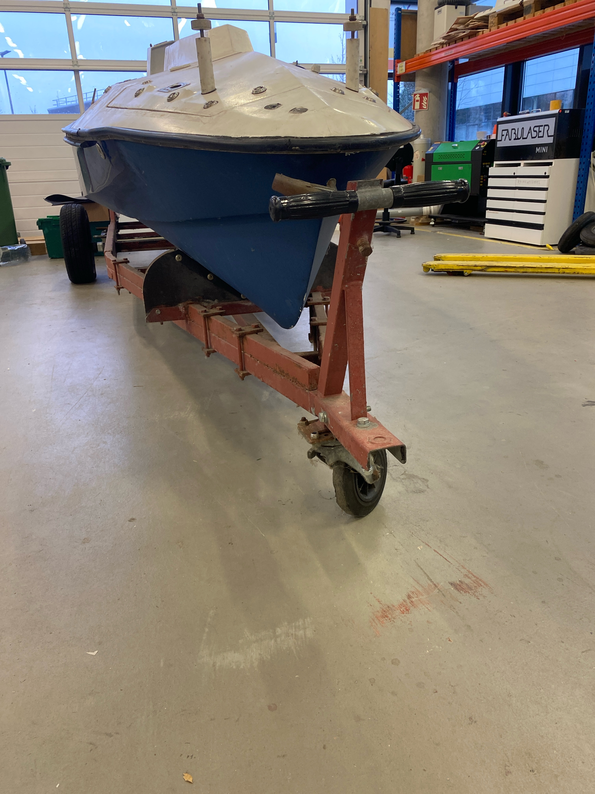

> ## Boat Automation Project

## Introduction
This is the first iteration of automating the boat owned by FabLab in Building 9. The lab inherited the boat itself, a Radar Marine system, a propulsion assembly with both high- and low-voltage motors, and several other devices scattered around the lab. These include a NASA compass, transducers, an IMU, and more.

## First Milestone
Right now, the goal is to get the boat back in the water. There are several steps required to make it run remotely (and autonomously in the future). The focus is on creating three main components: the low-voltage motor unit, the steering unit, and the wireless communication unit.

## Low-Voltage Motor Unit
**Objective:** Develop an Arduino-based system that reads RPM from two rotating shafts (attached to low-voltage DC motors) using two hall sensors. The program should process the RPM values and adjust PWM outputs to ensure identical RPM for both motors.

**How to Achieve It:**
- **Arduino R4 Software:**
  - Implement interrupt functions.
  - Use a PID controller for PWM signal adjustments.
  - Add a dead switch handler.
- **Hardware:**
  - Connect motor driver MDDS60A logic pins to Arduino digital pins.
  - Prepare connectors for the motor driver (e.g., XT60 connectors).
  - Create protective housings for hall sensors and JST connectors.
  - Design and build a custom Arduino shield (PCB).
  - Design and fabricate housings for the Arduino board and motor driver, along with mounting attachments.

## Steering Unit
**Objective:** Build a closed-loop system for steering, using two DC motors to function as servo motors.

**How to Achieve It:**
- **Arduino R4 Project:**
  - Implement ADC handlers for input signals.
  - Create PWM output signal handlers with a PID controller.
- **Hardware:**
  - Design and fabricate a custom Arduino shield (PCB).
  - Build housings and mounting attachments for the motor driver and Arduino board.

## Wireless Communication Unit
**Objective:** Create an Arduino-based system that can receive four distinct signals and send them to the propulsion and steering units.

**How to Achieve It:**
- Choose a wireless technology: RC or LoRa for signal receiving.
- Develop a custom Arduino R4 shield for the communication unit.
- Set up CAN communication for signal propagation to other units.
- Alternatively, use an ESP module on the Arduino R4 for temporary signal propagation via Wi-Fi or Bluetooth.

## Trailer Front Wheel
**Objective:** Update the front wheel of the boat's trailer.

**How to Achieve It:**
- Select all the necessary components.
- Make a CAD model.
- Create detailed drawings.
- Complete the assembly and attach it to the trailer.
